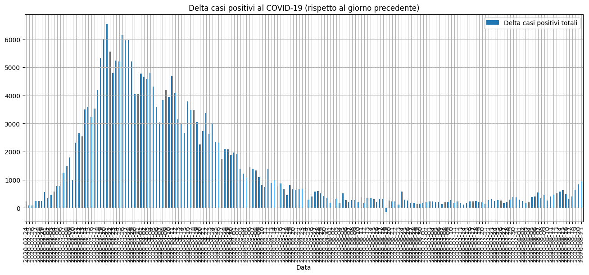
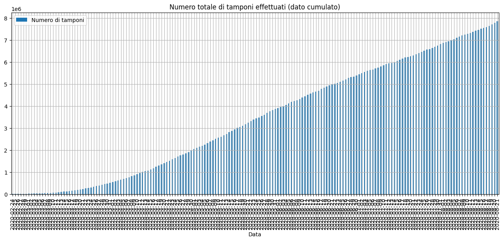
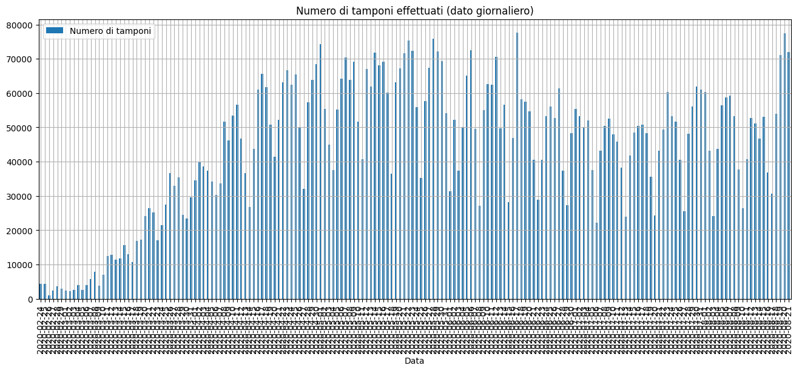
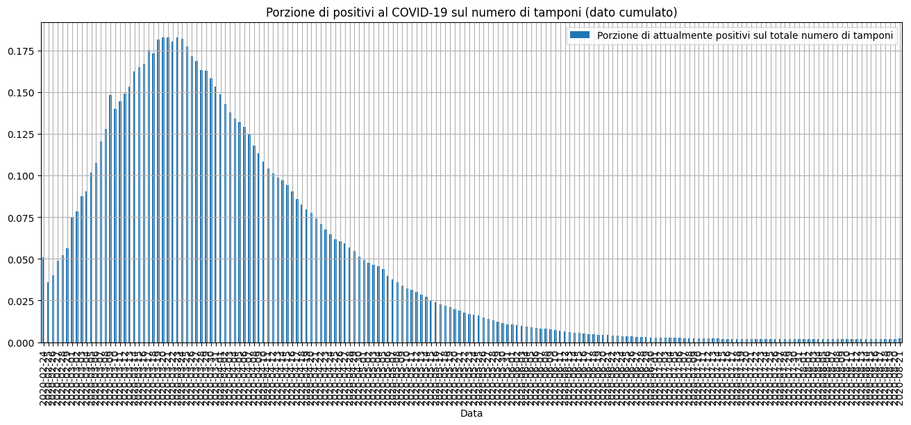
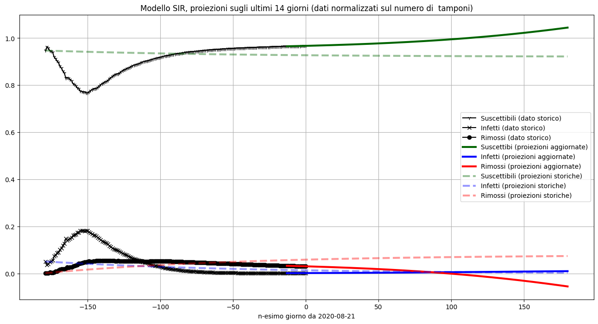

# COVID-19 Italia

Questo sito contiene informazioni relative all'andamento di COVID-19 in Italia. 
I vari grafici e le proiezioni sono ricavati a partire dai dati ufficiali rilasciati dalla Protezione Civile al seguente link: [Repository della Protezione Civile su COVID-19](https://github.com/pcm-dpc/COVID-19).
Le proiezioni fornite dal presente sito sono basate su modelli semplici, e quindi non affidabili.  

## Andamento nazionale

### Casi totali 

### Delta giornaliero casi totali

### Tamponi

### Tamponi giornalieri

### Forecast tamponi

### Totale casi / tamponi effettuati

### Attualmente positivi / tamponi effettuati

### Dimessi e deceduti

### Simulazione modello SIR storico 7 giorni

### Simulazione modello SIR storico 14 giorni

