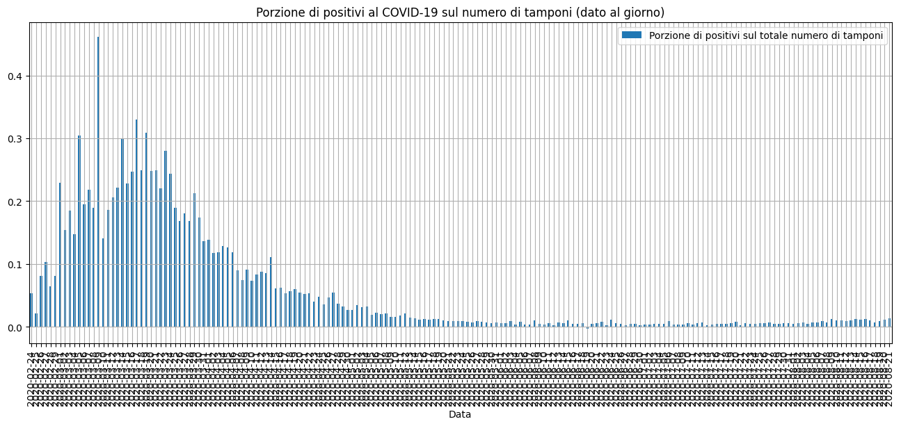
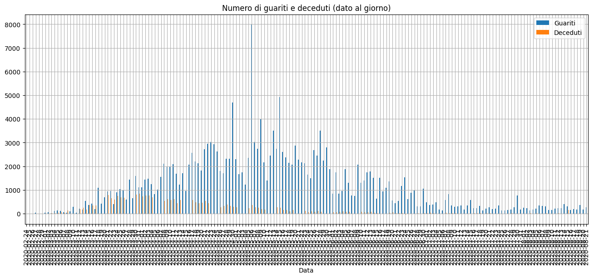
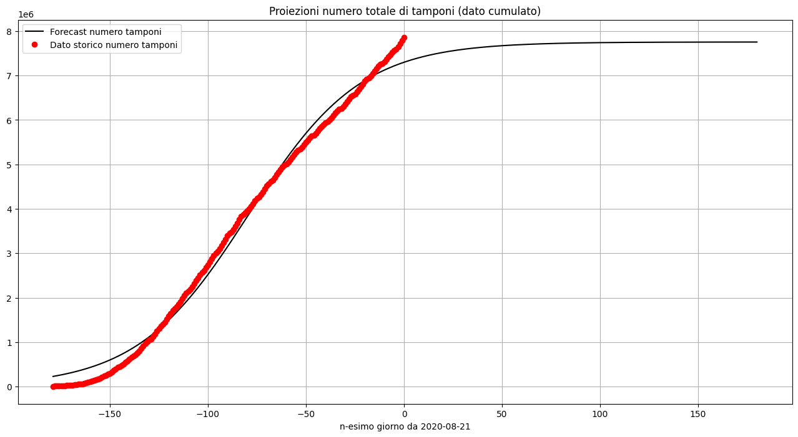
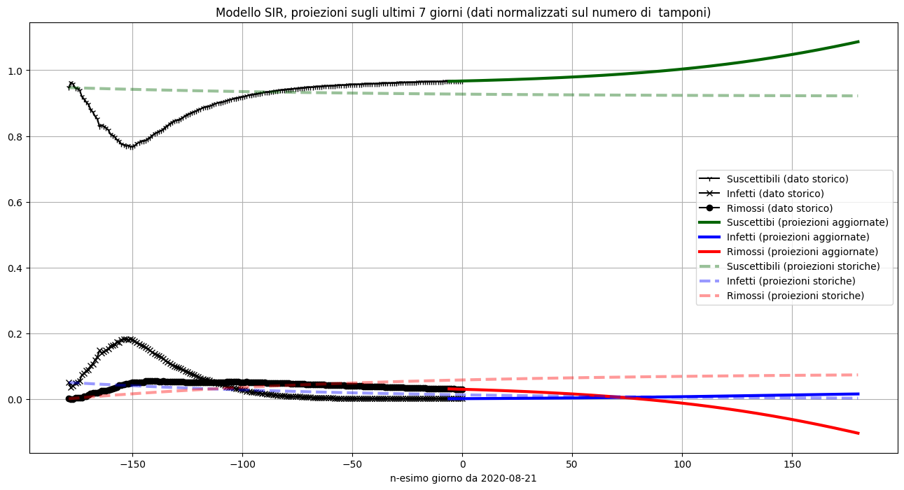
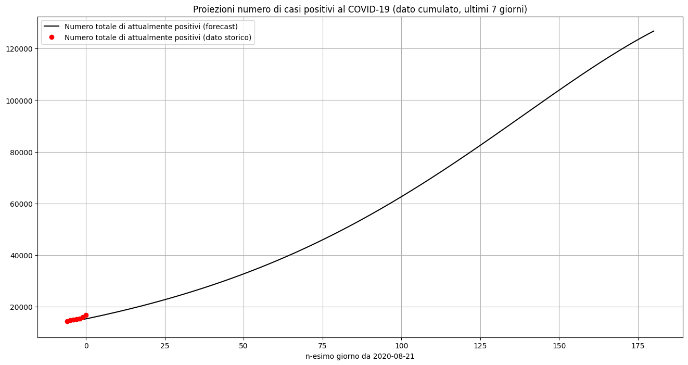
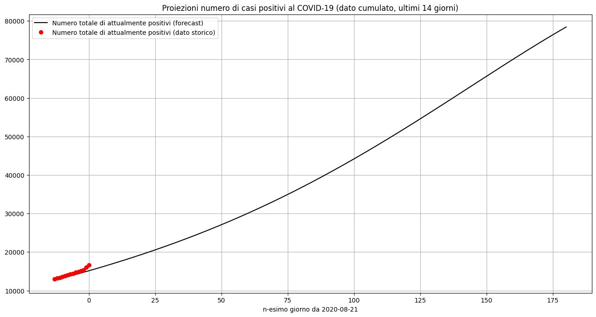

# COVID-19 Italia - Andamento Nazionale

[Homepage](README.md)

## Ultimi dati aggiornati

### Casi totali 

### Delta giornaliero casi totali

### Tamponi

### Tamponi giornalieri

### Totale casi / tamponi effettuati

### Attualmente positivi / tamponi effettuati

### Dimessi e deceduti

## Previsioni 

Le previsioni presentate qui sotto sono ottenute usando modelli semplicistici e ignorano elementi che sono determinanti in un setting realistico (es. fattori esogeni, dinamiche di diffusione, interventi restrittivi, ecc.). La creazione di un modello di precisione che faccia il forecast dell'andamento dell'epidemia va oltre lo scopo di queste pagine che invece sono a scopo puramente illustrativo e di studio. 

### Forecast tamponi

### Simulazione modello SIR storico 7 giorni

### Simulazione modello SIR storico 14 giorni

[Homepage](README.md)