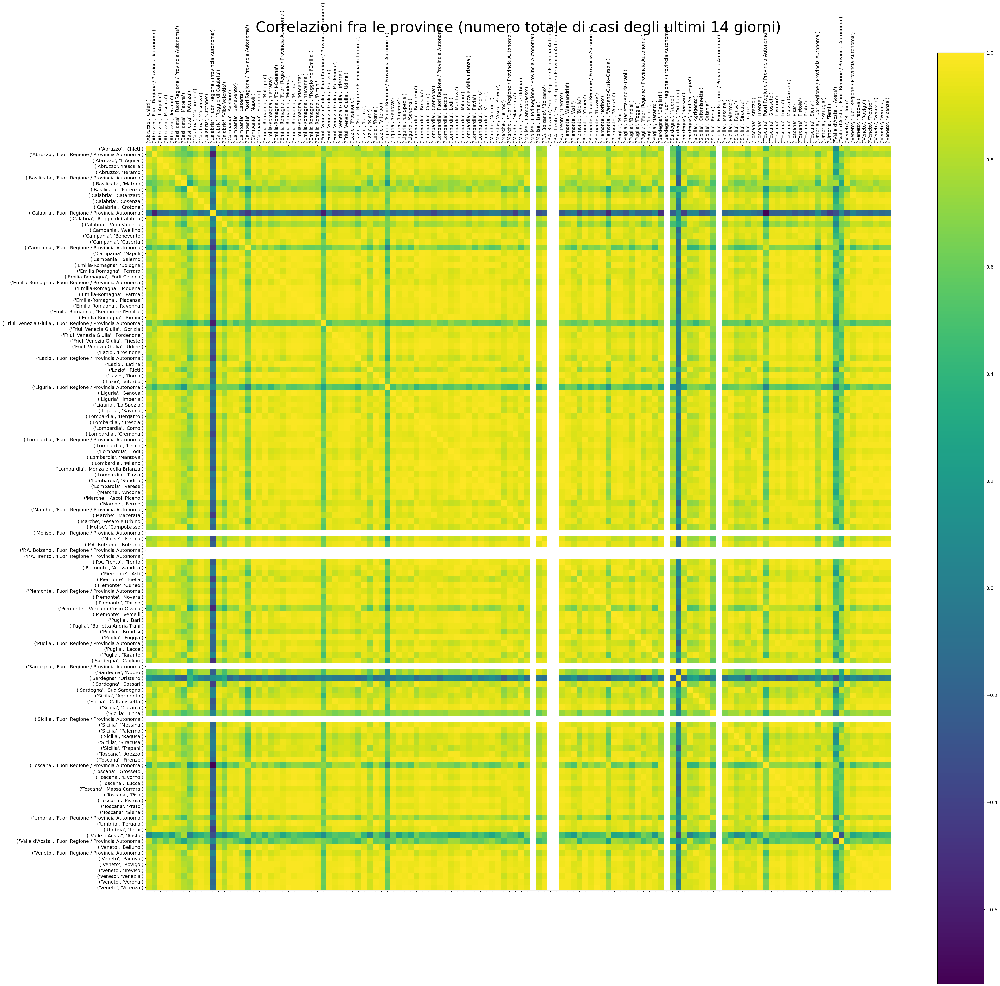
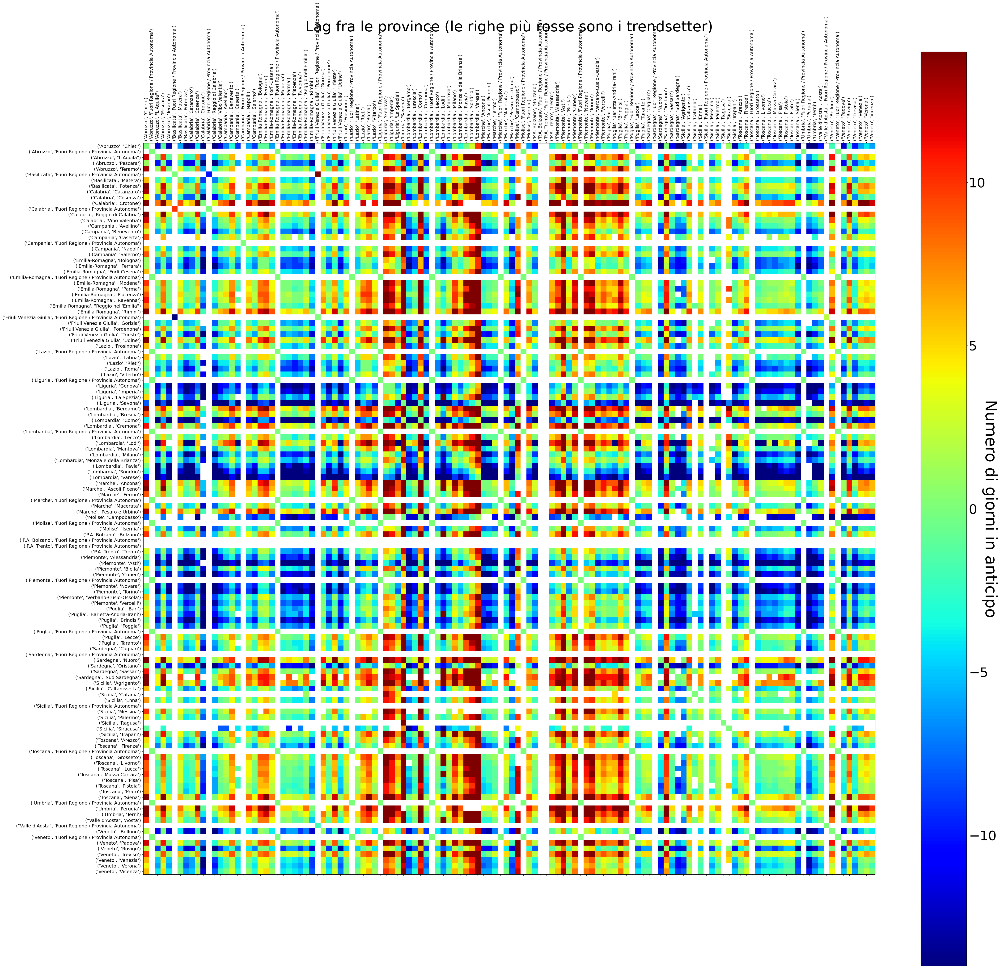

# COVID-19 Italia - Situazione nelle province

[Homepage](README.md)

## Ultimi dati aggiornati

### Correlazioni fra le province (dal giorno 0)

Questa matrice di correlazione mostra quanto sono correlati i numeri totali di contagiati (dall'inizio dell'epidemia) delle varie province. 

### Correlazioni fra le province (ultime due settimane)

Questa matrice di correlazione mostra quanto sono correlati i numeri totali di contagiati (ultimi 14 giorni) delle varie province. 

### Trendsetter

Questa matrice mostra una stima potenziale di giorni di lag ci sono tra le curve del numero totale dei contagi delle varie province. 

[Homepage](README.md)